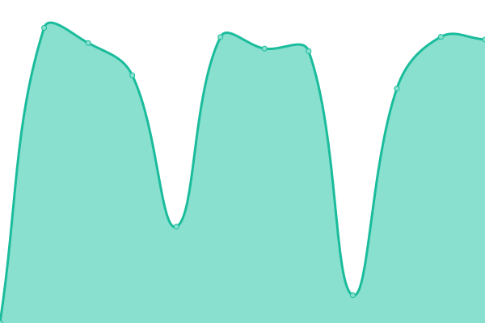
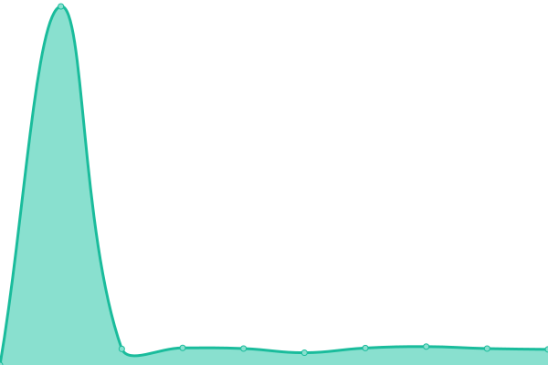

# [📈 Live Status](https://status.raznar.id): <!--live status--> **🟧 Partial outage**

This repository contains the open-source uptime monitor and status page for [Raznar Hosting](https://raznar.id/), powered by [Upptime](https://github.com/upptime/upptime).

With [Upptime](https://upptime.js.org), you can get your own unlimited and free uptime monitor and status page, powered entirely by a GitHub repository. We use [Issues](https://github.com/Raznar-Hosting/uptime-monitor-v2/issues) as incident reports, [Actions](https://github.com/Raznar-Hosting/uptime-monitor-v2/actions) as uptime monitors, and [Pages](https://status.raznar.id) for the status page.

<!--start: status pages-->
<!-- This summary is generated by Upptime (https://github.com/upptime/upptime) -->
<!-- Do not edit this manually, your changes will be overwritten -->
<!-- prettier-ignore -->
| URL | Status | History | Response Time | Uptime |
| --- | ------ | ------- | ------------- | ------ |
|  [NSTR-JKT1](https://ping-game-nstr-jkt1.raznar-server.uk) | 🟩 Up | [nstr-jkt-1.yml](https://github.com/Raznar-Hosting/uptime-monitor-v2/commits/HEAD/history/nstr-jkt-1.yml) | 

 852ms
     
 | 

<a href="https://status.raznar.id/history/nstr-jkt-1">100.00%</a>
    

|  [NSTR-JKT2](https://ping-game-nstr-jkt2.raznar-server.uk) | 🟩 Up | [nstr-jkt-2.yml](https://github.com/Raznar-Hosting/uptime-monitor-v2/commits/HEAD/history/nstr-jkt-2.yml) | 

 844ms
     
 | 

<a href="https://status.raznar.id/history/nstr-jkt-2">100.00%</a>
    

|  [Main Website](https://raznar.id) | 🟩 Up | [main-website.yml](https://github.com/Raznar-Hosting/uptime-monitor-v2/commits/HEAD/history/main-website.yml) | 

 819ms
     
 | 

<a href="https://status.raznar.id/history/main-website">100.00%</a>
    

|  [Billing Website](https://my.raznar.id) | 🟩 Up | [billing-website.yml](https://github.com/Raznar-Hosting/uptime-monitor-v2/commits/HEAD/history/billing-website.yml) | 

 2308ms
     
 | 

<a href="https://status.raznar.id/history/billing-website">99.52%</a>
    

|  [APP-JKT1](https://app-jkt1.raznar-server.uk:8443) | 🟩 Up | [app-jkt-1.yml](https://github.com/Raznar-Hosting/uptime-monitor-v2/commits/HEAD/history/app-jkt-1.yml) | 

 871ms
     
 | 

<a href="https://status.raznar.id/history/app-jkt-1">100.00%</a>
    

|  [GNL-JKT1](https://game-gnl-jkt1.raznar-server.uk:8443) | 🟩 Up | [gnl-jkt-1.yml](https://github.com/Raznar-Hosting/uptime-monitor-v2/commits/HEAD/history/gnl-jkt-1.yml) | 

 814ms
     
 | 

<a href="https://status.raznar.id/history/gnl-jkt-1">100.00%</a>
    

|  [GNL-JKT2](https://game-gnl-jkt2.raznar-server.uk:8443) | 🟩 Up | [gnl-jkt-2.yml](https://github.com/Raznar-Hosting/uptime-monitor-v2/commits/HEAD/history/gnl-jkt-2.yml) | 

 837ms
     
 | 

<a href="https://status.raznar.id/history/gnl-jkt-2">100.00%</a>
    

|  [GNL-JKT3](https://game-gnl-jkt3.raznar-server.uk:8443) | 🟩 Up | [gnl-jkt-3.yml](https://github.com/Raznar-Hosting/uptime-monitor-v2/commits/HEAD/history/gnl-jkt-3.yml) | 

 801ms
     
 | 

<a href="https://status.raznar.id/history/gnl-jkt-3">100.00%</a>
    

|  [GNL-JKT4](https://game-gnl-jkt4.raznar-server.uk:8443) | 🟩 Up | [gnl-jkt-4.yml](https://github.com/Raznar-Hosting/uptime-monitor-v2/commits/HEAD/history/gnl-jkt-4.yml) | 

 996ms
     
 | 

<a href="https://status.raznar.id/history/gnl-jkt-4">100.00%</a>
    

|  [GNL-JKT5](https://game-gnl-jkt5.raznar-server.uk:8443) | 🟥 Down | [gnl-jkt-5.yml](https://github.com/Raznar-Hosting/uptime-monitor-v2/commits/HEAD/history/gnl-jkt-5.yml) | 

 3482ms
     
 | 

<a href="https://status.raznar.id/history/gnl-jkt-5">100.00%</a>
    

|  [GNL-JKT6](https://game-gnl-jkt6.raznar-server.uk:8443) | 🟩 Up | [gnl-jkt-6.yml](https://github.com/Raznar-Hosting/uptime-monitor-v2/commits/HEAD/history/gnl-jkt-6.yml) | 

 750ms
     
 | 

<a href="https://status.raznar.id/history/gnl-jkt-6">100.00%</a>
    

<!--end: status pages-->

[**Visit our status website →**](https://status.raznar.id)

## 📄 License

- Powered by: [Upptime](https://github.com/upptime/upptime)
- Code: [MIT](./LICENSE) © [Anand Chowdhary](https://anandchowdhary.com), supported by [Pabio](https://pabio.com)
- Data in the `./history` directory: [Open Database License](https://opendatacommons.org/licenses/odbl/1-0/)
